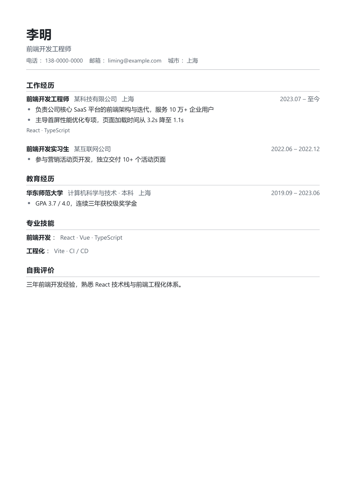

# 简白 JianBai

一款**本地优先、所见即所得**的极简简历编辑器。



- 数据 100% 保存在本地，不上传任何服务器
- 编辑区与 PDF 由同一套渲染组件生成，导出与预览**像素级一致**
- 默认**极简纯文本**排版，所有装饰元素（图标 / 照片 / 标签胶囊 / 技能条）均为可选开关
- 导出的 PDF 文字可选中、可复制，对 ATS 简历解析系统友好

## 功能

### 内容编辑
- 内置模块：基本信息、教育经历、工作经历、项目经历、专业技能、证书荣誉、自我评价
- 任意**自定义模块**：标题自拟，支持富文本或条目列表
- 模块与条目支持拖拽排序、折叠、显示/隐藏、重命名、增删
- 撤销/重做（Ctrl+Z / Ctrl+Y），连续输入自动合并为一步
- 富文本编辑：加粗、斜体、下划线、有序/无序列表、链接；粘贴自动转纯文本
- 多份简历管理：按岗位各存一份，可复制 / 删除 / 重命名
- **导入解析**：选择已有的 PDF / Word / 文本简历，自动解析为结构化内容（尽力解析，导入后请检查修正）

### 设计自定义
- 模板：简约单栏（自动分页）/ 双栏侧边
- 主题：强调色、字体（雅黑 / 宋体 / 楷体 / 仿宋等）、字号、行距、页边距、模块间距
- 装饰元素全部默认关闭、按需开启：细分隔线、小图标、照片（保持原始比例）、标签胶囊、技能熟练度条
- 高级：自定义 CSS 注入

### 导出
- 一键导出 PDF（A4 / Letter，自动分页，分页点避开单条经历）
- JSON 全量备份 / 恢复，数据随时可迁移

### 快捷键
| 快捷键 | 功能 |
|---|---|
| Ctrl+Z / Ctrl+Y | 撤销 / 重做 |
| Ctrl+S | 立即保存 |
| Ctrl+E | 导出 PDF |
| Ctrl+N | 新建简历 |
| Ctrl+D | 复制当前简历 |

## 开发

```bash
npm install        # 国内网络建议先设置 ELECTRON_MIRROR=https://npmmirror.com/mirrors/electron/
npm run dev        # 启动开发模式（Vite + Electron 热更新）
npm run build      # 构建渲染层
npm start          # 运行已构建的桌面应用
npm run dist       # 打包 Windows 安装包（输出到 out/）
npm run typecheck  # TypeScript 类型检查
```

## 数据位置

所有简历保存在 `%APPDATA%\简白\resumes.json`（Windows），换机迁移直接拷贝该文件或使用应用内「导出备份 / 导入备份」。旧版本（简历制作机）的数据会在首次启动时自动迁移。

## 技术栈

Electron · React 18 · TypeScript · Vite · Zustand · dnd-kit · pdf-parse · mammoth

PDF 导出方案：隐藏窗口加载同一套 React 渲染组件，调用 Chromium `printToPDF`，保证预览与成品一致且文字可选中。

## License

MIT
